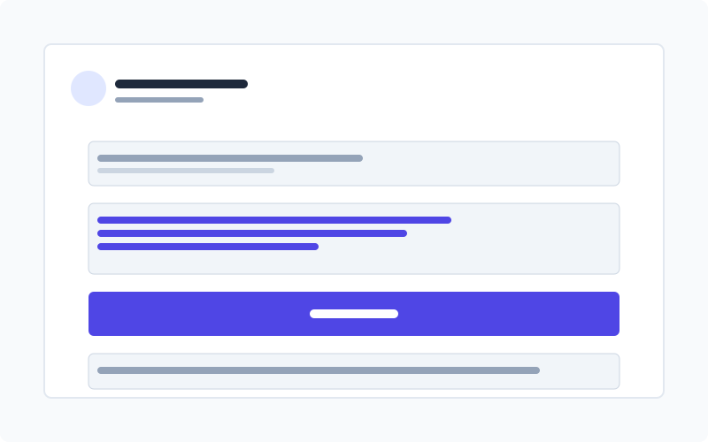

<div align="center">
  
  <h1>Link to Text Desktop</h1>
  <p>🔗 生成带有文本片段高亮的链接，让分享更精准</p>
  <p>
    <a href="#功能特点">功能特点</a> •
    <a href="#安装指南">安装指南</a> •
    <a href="#使用方法">使用方法</a> •
    <a href="#常见问题">常见问题</a> •
    <a href="#开发指南">开发指南</a> •
    <a href="#许可证">许可证</a>
  </p>
  <p>
    
  </p>
</div>

## 📖 简介

Link to Text Desktop 是一款桌面应用，可以帮助你生成带有 `#:~:text=` 文本片段的链接。这种链接在支持的浏览器中打开时，会自动滚动到指定文本并高亮显示。非常适合：

- 📚 分享文章中的特定段落
- 🔍 指向文档中的关键信息
- 📝 引用网页中的特定内容
- 💬 在讨论中精确引用网页内容

## ✨ 功能特点

- 🚀 **简单易用**：输入 URL 和要高亮的文本，一键生成链接
- 🔍 **精准定位**：支持前缀和后缀上下文匹配，解决重复文本问题
- 📋 **便捷复制**：一键复制生成的链接到剪贴板
- 🌐 **即时测试**：直接在应用中打开链接进行测试
- 💻 **跨平台**：支持 Windows、macOS 和 Linux

## 📥 安装指南

### Windows

1. 从 [Releases](https://github.com/你的用户名/link-to-text-desktop/releases) 页面下载最新的 `.exe` 或 `.msi` 安装文件
2. 双击安装文件，按照提示完成安装
3. 首次运行时可能会出现安全警告，点击"更多信息"然后"仍要运行"即可

### macOS

1. 从 [Releases](https://github.com/你的用户名/link-to-text-desktop/releases) 页面下载最新的 `.dmg` 文件
2. 双击 `.dmg` 文件，将应用拖到 Applications 文件夹
3. **注意**：由于应用未使用 Apple 开发者证书签名，首次运行时会显示"已损坏"错误
4. 解决方法：打开终端，运行以下命令：
   ```bash
   xattr -cr "/Applications/Link to Text Desktop.app"
   ```
5. 然后在"系统偏好设置 > 安全性与隐私"中允许打开应用

### Linux

1. 从 [Releases](https://github.com/你的用户名/link-to-text-desktop/releases) 页面下载适合你发行版的包（`.AppImage`、`.deb` 或 `.rpm`）
2. 根据你的发行版，使用相应的方法安装

## 🚀 使用方法

1. **输入网页链接**：粘贴你想要分享的网页 URL
2. **输入要高亮的文本**：复制并粘贴你想要高亮的文本内容
3. **（可选）添加上下文**：如果文本在页面中多次出现，可以添加前缀和后缀以精确定位
4. **生成链接**：点击"生成链接"按钮
5. **复制或测试**：复制链接到剪贴板，或点击"测试链接"在浏览器中查看效果

## ❓ 常见问题

### 支持哪些浏览器？

文本片段链接目前支持：
- Google Chrome (80+)
- Microsoft Edge (基于 Chromium)
- Opera (基于 Chromium)
- 其他基于 Chromium 的浏览器

Firefox 和 Safari 目前不支持此功能。

### 为什么 macOS 显示应用"已损坏"？

由于我们构建的应用没有使用 Apple 开发者证书进行签名，macOS 会将其标记为"已损坏"。

**临时解决方案**：
```bash
xattr -cr "/Applications/Link to Text Desktop.app"
```

**长期解决方案**：
* 要彻底解决这个问题，需要使用 Apple 开发者证书对应用进行签名
* 获取 Apple 开发者证书需要注册 Apple Developer Program（年费 99 美元）
* 我们计划在未来版本中添加正式签名

### Windows 安全警告如何处理？

Windows 用户可能会看到 SmartScreen 警告：
* 基本上可以直接使用，点击"更多信息"然后"仍要运行"
* 这是因为应用未使用代码签名证书，但不影响功能

## 🛠️ 开发指南

### 技术栈

- [Next.js](https://nextjs.org/) - React 框架
- [Tauri](https://tauri.app/) - 构建跨平台桌面应用
- [TypeScript](https://www.typescriptlang.org/) - 类型安全的 JavaScript
- [Tailwind CSS](https://tailwindcss.com/) - 实用优先的 CSS 框架

### 项目结构

```
link-to-text-desktop/
├── src/                    # Next.js 前端源代码
│   ├── app/                # App Router 页面
│   └── components/         # React 组件
├── src-tauri/              # Tauri 后端代码
│   ├── src/                # Rust 源代码
│   └── icons/              # 应用图标
├── public/                 # 静态资源
└── docs/                   # 文档和图片
```

### 本地开发

1. 安装依赖：
   ```bash
   npm install
   ```

2. 启动开发服务器：
   ```bash
   npm run tauri dev
   ```

3. 构建生产版本：
   ```bash
   npm run tauri build
   ```

## 📄 许可证

[MIT](LICENSE)

## 🙏 致谢

- 灵感来源于 [Link to Text Fragment](https://github.com/link-to-text/link-to-text.github.io)
- 基于 [Text Fragments](https://wicg.github.io/scroll-to-text-fragment/) Web 标准 